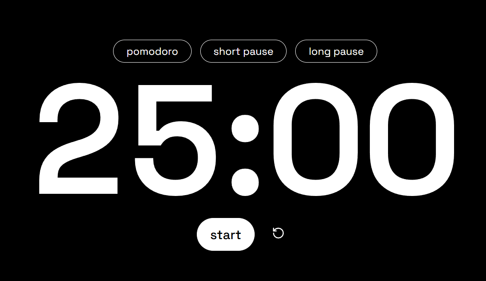

# ⏱️ Minimal Pomodoro Timer

Um timer Pomodoro minimalista, direto ao ponto, feito com HTML, CSS e JavaScript puro. Ideal para foco total, sem distrações.

🌐 **Site em produção**: [https://minimalpomodoro.vercel.app](https://minimalpomodoro.vercel.app)

---

## 🎯 Funcionalidades

- **Timer Pomodoro padrão (25:00)** com modo:
  - 🍅 Pomodoro (25 min)
  - 🌿 Pausa Curta (5 min)
  - 🌴 Pausa Longa (15 min)
- **Botão Start/Pause integrado**
- **Botão Reset**
- **Botão de Tela Cheia (⛶)**
- 🔔 **Alarme em loop** quando o tempo acaba (arquivo `alarm.mp3`)
- Interface minimalista, com fonte estilo relógio digital

---

## 🚀 Como usar

1. Clone ou baixe o repositório.
2. Certifique-se de ter o arquivo `alarm.mp3` na mesma pasta que o HTML.
3. Abra o `index.html` em qualquer navegador moderno.
4. Clique em Start e foque!

---

## 📷 Imagem

> A imagem de preview mostra o timer rodando em tela cheia, com visual limpo e botões funcionais.

---

## 📄 Licença

Livre para uso pessoal e educacional. Para uso comercial, personalize e dê os créditos.

---
